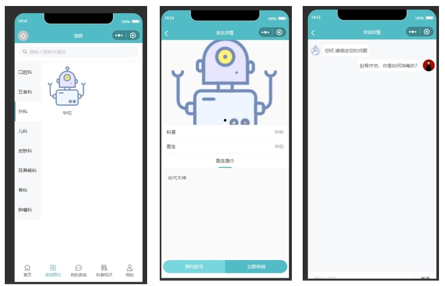
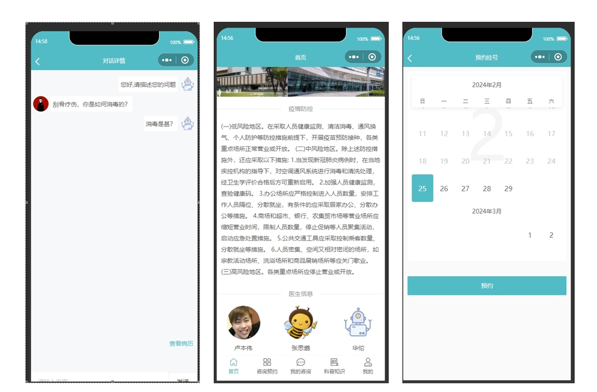
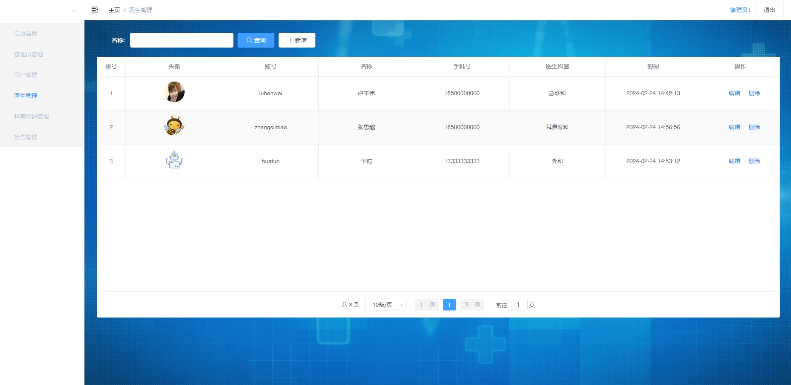
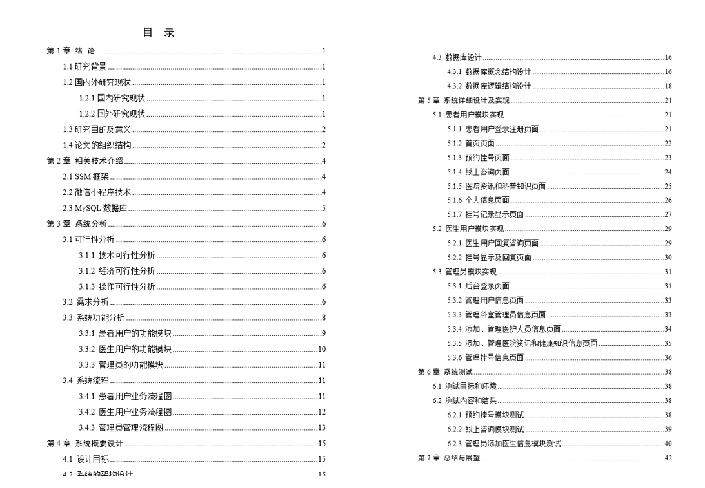

**郑重声明: 项目经过本地测试，确保可以运行， 可以用于学习和毕业设计参考~**

#### 1.项目简介
- 技术选型：SpringBoot + Vue + 原生微信小程序

**系统功能：**

- 小程序端：病情咨询、预约挂号、科普知识
- 后端：用户管理、科普管理、挂号管理、医生管理
- 角色：普通用户、医生、管理员

**内附格式较为规范的项目说明文档， 本项目仅供学习参考~**

#### 2.本地部署
##### 2.1 后端启动
- 创建MySQL数据库，导入项目中的sql文件
- 通过IDEA导入项目
- 修改admin-api项目下的配置文件，根据本地环境，修改数据库连接
- 启动admin-api项目

##### 2.2 管理web
- 进入admin-web目录，也可以通过IDEA或者webStorm打开admin-web项目（idea需要安装vue插件）
- npm install
- npm run dev
- 根据提示打开链接，账号/密码： admin/admin

##### 2.3 微信小程序
- 打开微信开发工具，微信扫码登录
- 导入mini-wechat-app
- 选择测试号即可
- 登录账号可以查看user表。普通用户 ： user/user  医生： huatuo/huatuo

#### 3.项目部分截图

